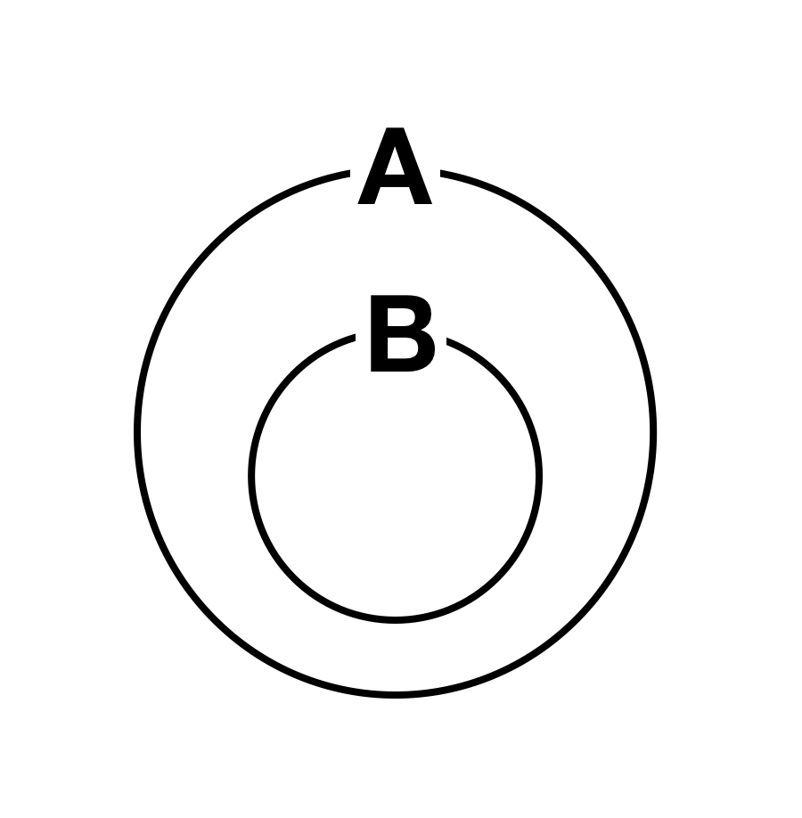

# Q & A
## 1. 해석을 했는데 무슨 말인지 모르겠어요. - 2
이번에 해석이 안되는 이유는 영어문장을 한국어로 옮길 때, 조사를 제대로 붙여주지 않았기 때문입니다. 

한국어는 조사가 있고, 영어는 조사가 없죠. 
한국어는 조사가 문장성분을 알려주시만 영어는 문장 속에서 단어가 차지하는 자리가 곧 문장성분이 됩니다. 
따라서 한국어로 옮길 때, 조사까지 붙여가며 해석해야 표면적 의미뿐만 아니라, 문법적 의미까지 완벽하게 해석하게 됩니다. 

>`표면적 의미`란 단어가 가지는 사전적 의미를 말해요. 단어가 전달하는 핵심적인 의미를 말합니다. 
>`문법적 의미`는 단어에 포함되어 있는 문법적인 의미를 말해요. 
> 예를 들어,`ran`은 `달리다`라는 표면적 의미와 `과거`라는 문법적 의미를 가지고 있어요. 
> `표면적 의미`와 `문법적 의미` 둘 모두를 짚어줘야 정확한 해석을 할 수 있어요. 
> 영어교육에서 통용되는 용어는 아니고 설명을 쉽게 하기 위해 제가 나눈 개념입니다.

직독직해를 하면서 해석하는 훈련을 할 때, 꼭 끝에 조사를 붙이는 습관을 들여주세요. 
그래야 자리를 통해 문장성분을 파악하는 훈련이 됩니다. 
조사가 있는 우리는 자리를 통해 문장성분을 파악해본 적이 없어서 훈련이 필요한 부분이에요. 
자전거 타는 법처럼 익숙해지고 나서는 의식하지 않아도 자연스럽게 되겠지만, 그 전까지는 조사를 붙여가며 해석해야 훈련이 됩니다. 
만약 어떤 조사를 붙여야 할지 모르겠다면, 그건 문장성분을 파악하지 못했다는 의미이므로 본인의 부족한 부분을 파악하기에도 좋습니다.
## 2. that으로 시작하는 명사절은 어떻게 해석해야 하나요?
통상적인 명사절처럼 `~것`으로 해석이 잘 될 땐 아마 문제가 없을 거에요. 
- `That I like her` is no secret.
- `내가 그녀를 좋아하는 것`은 비밀이 아니다.(공공연한 사실이다.)

지금은 `I think that ~` `I believe that ~`과 같은 구조를 해석할 때, 문제가 생기는데요. 
이런 경우에는 `~라고` 해석해주면 됩니다.
- I think `that he is genius.`
- 난 `그가 천재라고` 생각해.

문장이 길어져서 `~라고`를 어디에 붙여야할지 모르겠다면, 동사 뒤에다가 붙여주면 됩니다.

## 3. of가 나오면 해석이 꼬여요.
해석이 안되는 이유는 두 가지로 나눌 수 있을 것 같아요. 
1. 관계가 아닌 순서로 해석하려고 해서
1. 무조건 `~의`라고 해석하려고 해서

하나씩 살펴볼게요
### 원인 1. 관계가 아닌 순서로 해석하려고 해서
`of`가 나오면 헷갈리는 가장 큰 이유입니다. 
한국말에서는 `A의 B`라고 하고, 같은 의미를 영어에서는 `B of A`라고 하죠. 
그래서 `of`는 `~의`라고 배웠고, `A의 B`라는 "순서"가 익숙하니까 `B of A`를 보고 `B의 A`라고 해석해서 생기는 문제입니다. 

무조건 `~의`라고 해석하는 게 아니라 "관계"를 느끼는 게 중요합니다. 
`A의 B`는 아래와 같은 관계를 가지고 있습니다. B는 A에 종속되어 있는 관계입니다. 

 

따라서 같은 관계를 표현하지만, 단지 언급하는 순서가 다르다고 생각하면 됩니다. 
즉, 관계를 먼저 느끼고, 이게 어떤 순서로 포현되는지를 익히면 좋을 거 같아요. 

> 이런 차이에서 영어를 쓰는 사람과 한국어를 쓰는 사람의 관점의 차이가 보여서 재밌지 않나요?:)

### 원인 2. 무조건 `~의`라고 해석하려고 해서
`of`는 `~의`말고도 많은 쓰임새가 있어요. 
따라서 잘 해석한 거 같은데도 어색하다면 `of`의 다른 뜻을 모르고 있는건 아닌지
합리적 의심을 하며 of의 뜻을 검색해보도록 합시다. 

### 원인 1일 경우 연습방법.
