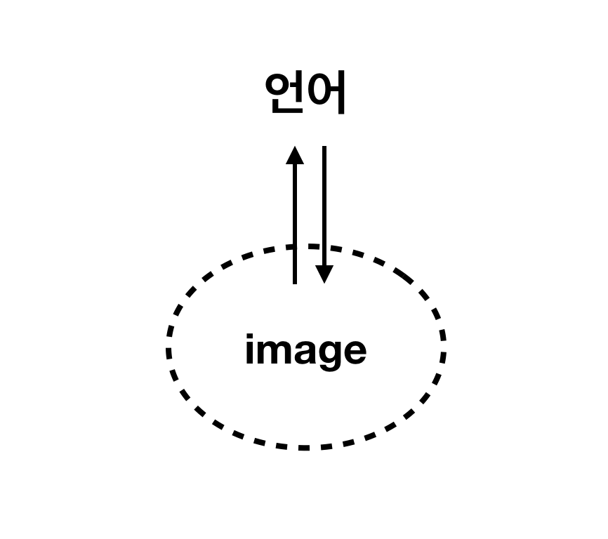
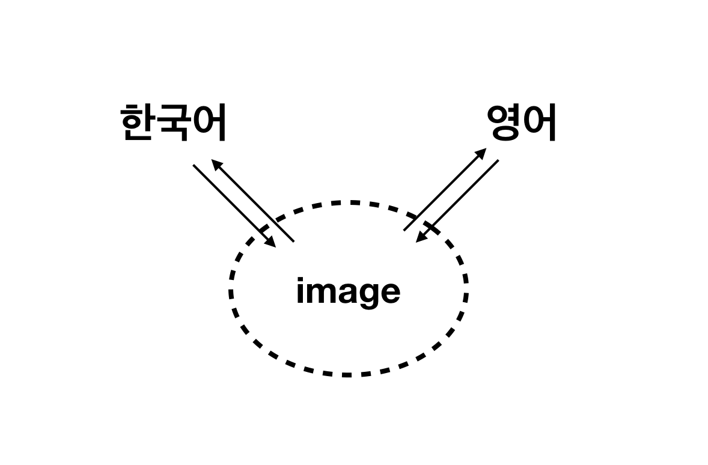
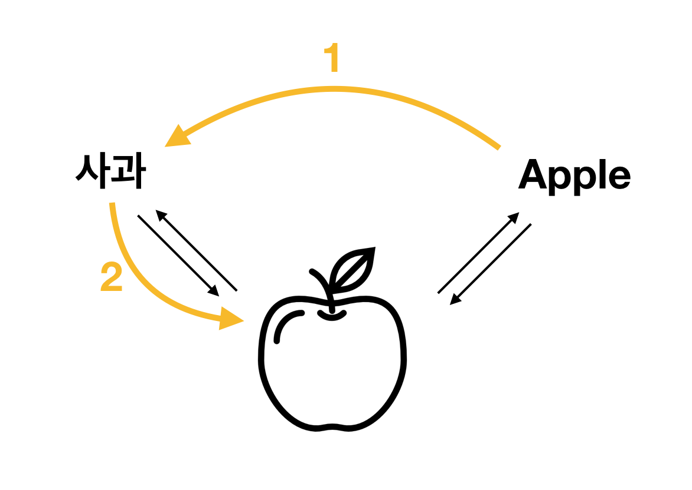
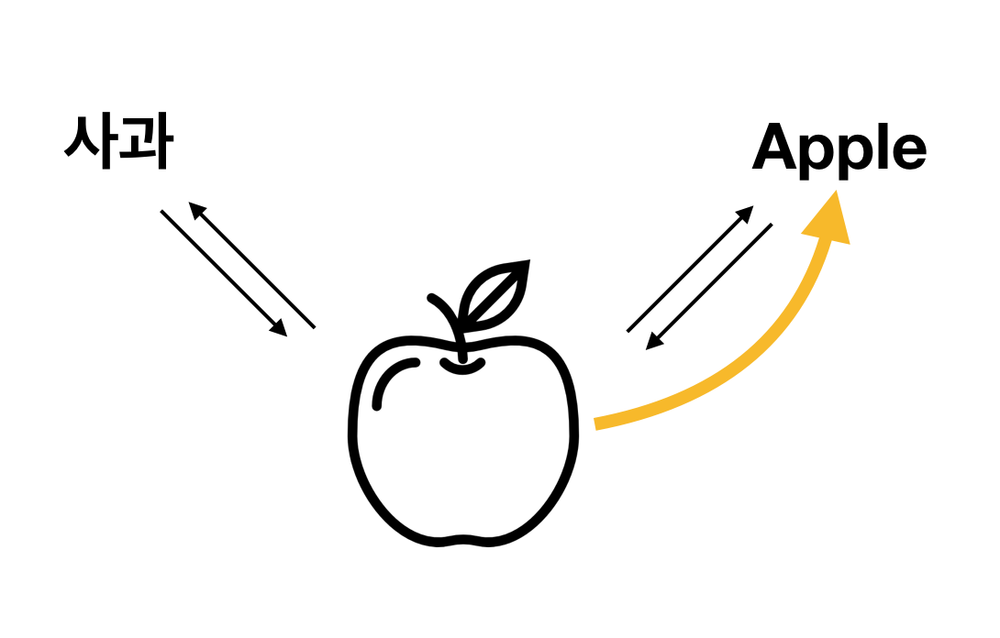

## 언어란?
언어는 말이나 글로써 세상을 그리는 일, 혹은 상대방의 말과 글을 통해 머릿속에 그림을 그리는 일입니다. 
세상을 이루고 있는 이미지들을 언어로 바꾸는 거죠. 

 

다만 한국사람은 한국어를, 영어가 모국어인 사람은 영어를 사용할 뿐, 언어를 이용해 그림을 그린다는 본질은 같습니다. 

 

따라서 영어를 배울 때도 한국어로 해석한다기 보다는, 영어를 통해 머릿속에 그림을 그린다고 생각하면 좀 더 빨리 익숙해질거에요! 

## 언어를 익히는 과정
처음에는 아마 다음과 같은 과정을 거쳐서 그림을 그릴(= 해석)거에요.
1. 영어문장을 본다.
1. 한국어로 옮긴다.
1. 머리에 그림이 그려진다.

위 과정을 반복하다보면 익숙해지면서
1. 영어문장을 본다.
1. 머리에 그림이 그려진다.

이렇게 머리에 그림이 바로 그려질 거에요. 
예를들어 `apple -> 사과 -> 사과의 이미지`에서 `apple -> 사과의 이미지`로 변하는 거에요. 

 

 

결국 여러 번 반복하고, 자주 접하면서 익숙해지는 것이 중요해요!

## 언어의 요소
(학문적으로 나뉘어진 요소는 아니고, 제가 공부하면서 그리고 가르치면서 개인적으로 정리한 거에요) 
언어는 `단어`, `문법`, `문장`, `글`로 이루어져 있어요. 
`단어`가 모여서 `문장`이 되고, 
`문장`이 모여서 `글`이 됩니다. 
`문법`은 단어가 '어떻게 조립되어 문장이 되는지'를 정리해 놓은 거에요. 

 

> 문법은 지식을 전달하기 위한 수단이지 목적이 아니에요. 반복하면서 문장구조에 익숙해지고 나면 문법적 지식은 더이상 필요하지 않아요.

## 언어 학습
새로운 언어를 배울 때, 우리가 배우는 것은 `문장`을 어떻게 만드는가입니다. 
`글`부터는 문해력의 영역이에요. 글이 전달하는 메시지를 파악하는 것, 혹은 일관된 논조로 글을 쓰는 것에 관련된 영역이에요. 
하지만 글을 통해 언어를 익히는 것은 중요한데, 그 이유는 다음과 같아요.
1. 문맥을 통해 언어에 담긴 언어사용자들의 사고방식과 문화를 느낄 수 있기 때문에 자연스러운 언어를 구사할 수 있어요.
1. 직접 글을 쓰다보면 부족한 부분이 잘 드러나서, 실력이 빠르게 늡니다.

그래서 문장을 만드는 법과 해석하는 법에 어느 정도 익숙해지고 나서는 글을 통해 공부해야합니다.

