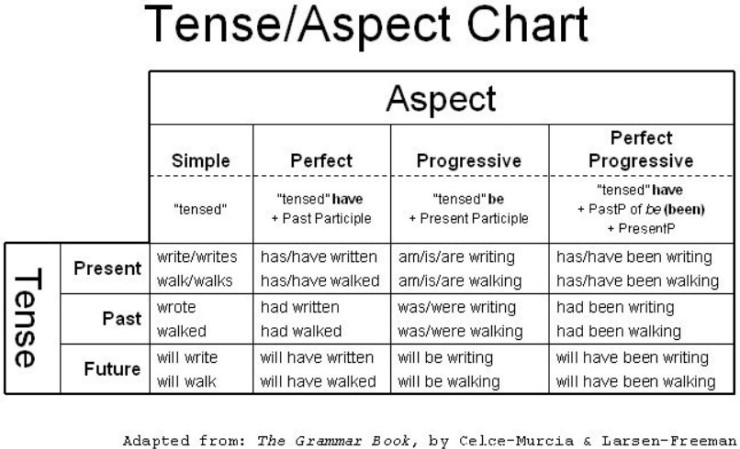

# 시제
시제 part에서는 어떻게 문장에 '시간'을 담을지 배울 거에요. 
우리는 대화하기 위해서는 다양한 시간표현이 필요해요. 
`했었다`고 말하고 싶기도 하고, `할거야`라고 말하고 싶을 때도 있고, `하는 중이야`라고 하고 싶기도 하니까요. 
ex> `I take a shower.` `I'm taking a shower.` `I took a shower.` `I'll take a shower.`
> [wiki](https://ko.wikipedia.org/wiki/시제)에서 시제에 관한 내용을 읽어보는 것도 재밌어요. 
시제를 어떻게 사용하는지를 보면 우리가 어떻게 사고하는지 보이거든요 
그리고 언어별로 시간을 어떻게 다르게 표현하는지 보면, 언어사용자마다 사고방식이 어떻게 다른지 보이거든요:)
## 시간표현의 구성
시간 표현은 크게 시제*tense*와 상*aspect*로 구성되어 있어요.
### 시제 - tense
시제는 사태가 발생한 시간적 위치를 나타내요.  
시제에는 `과거`, `현재`, `미래`가 있어요. 
`현재`보다 이전에 일어났으면 `과거`, `현재` 이후에 일어나면 `미래`입니다.
### 상 - aspect
상은 '동작이 일어나는 모습'이에요. 
> "사태의 내적 시간 구성을 가리키는 문법 범주입니다. 사태의 시간적 구조나 전개 양상을 바라보는 화자의 관점이 어디에 놓여 있는지를 문법적 수단을 통해 나타난 것입니다. "라고 설명하고 있기도 하네요 
> 출처: https://ratsgo.github.io/korean%20linguistics/2017/07/10/aspect/

상에는 `단순`, `진행`, `완료`, `진행 완료`이 있습니다.

### 정리표
영어에서는 시제와 상을 결합하여 시간을 표현합니다. 
그래서 총 12개의 시제가 존재해요.(시제 3개 x 상 4개) 
정리하면 아래 표와 같습니다.

 

